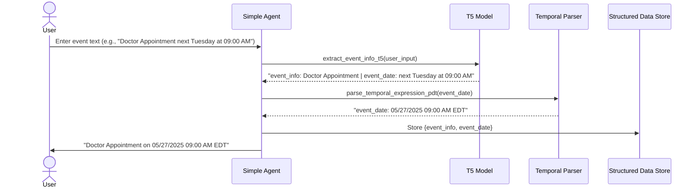

# White Paper: Machine Learning Approaches for Temporal Text Processing and Structured Data Generation

## Abstract

Temporal information extraction from natural language is a critical task for applications such as digital assistants, scheduling bots, and event management systems. This white paper outlines a practical, ML-driven pipeline for extracting event-related information and temporal expressions from unstructured text, converting them into structured, machine-readable formats. The approach leverages state-of-the-art sequence-to-sequence models (such as T5) and rule-based or ML-based temporal parsers, as exemplified in the provided codebase.

---

## 1. Introduction

Natural language often encodes event and time information in diverse, ambiguous, and context-dependent ways. For digital systems to act on such information (e.g., scheduling a meeting), it must be converted into a structured format (e.g., ISO 8601 datetime, event metadata). Traditional rule-based systems struggle with the variability of human language, motivating the use of ML models, especially large language models (LLMs), for robust extraction and normalization.

---

## 2. System Architecture Overview

The system is composed of two main ML-driven components:

### 2.1. Event Information Extraction (Sequence-to-Sequence Model)

- **Model**: A fine-tuned T5 (Text-to-Text Transfer Transformer) model.
- **Task**: Given a user utterance (e.g., "Doctor Appointment next Tuesday at 09:00 AM"), the model outputs a structured string, e.g.:
  ```
  event_info: Doctor Appointment | event_date: next Tuesday at 09:00 AM
  ```
- **Training**: The model is trained on a dataset of input sentences paired with their corresponding structured outputs, learning to identify and label event names and temporal expressions.

### 2.2. Temporal Expression Parsing

- **Tool**: A temporal parser (e.g., `parsedatetime` in Python).
- **Task**: Converts natural language date/time expressions (e.g., "next Tuesday at 09:00 AM") into exact, machine-readable datetime strings (e.g., "2025-05-27T09:00:00-04:00").
- **Approach**: Rule-based parsing, optionally enhanced with ML for ambiguous or context-dependent cases.

---

## 3. Pipeline Workflow

1. **User Input**: The user provides a natural language event description.
2. **Event Extraction**: The T5 model extracts the event name and temporal phrase.
3. **Temporal Parsing**: The temporal phrase is parsed into a precise datetime.
4. **Structured Output**: The system combines the event name and parsed datetime into a structured, storable format (e.g., JSON, database record).

**Example:**
```json
{
  "event_info": "Doctor Appointment",
  "event_date": "2025-05-27T09:00:00-04:00"
}
```

---

## 4. Machine Learning Techniques

### 4.1. Sequence-to-Sequence Learning

- **Model**: T5 or similar encoder-decoder architectures.
- **Advantages**: Handles diverse input phrasing, learns to generalize from examples, robust to noise.
- **Fine-tuning**: Requires a labeled dataset of (input, output) pairs. The output format should be consistent and parseable.

### 4.2. Temporal Parsing

- **Rule-Based**: Libraries like `parsedatetime` use hand-crafted rules for English temporal expressions.
- **ML-Enhanced**: For languages or domains with high ambiguity, ML models (e.g., BERT-based classifiers) can be used to disambiguate or pre-process temporal phrases.

### 4.3. Integration

- **Hybrid Approach**: ML for extraction, rules/ML for normalization.
- **Error Handling**: The system should gracefully handle extraction or parsing failures, prompting the user for clarification if needed.

---

## 5. Implementation Considerations

- **Model Selection**: Choose a model size (e.g., T5-small, T5-base) based on resource constraints and required accuracy.
- **Data Annotation**: High-quality, diverse training data is critical for robust extraction.
- **Timezone Handling**: Always normalize datetimes to a standard timezone for storage.
- **Extensibility**: The pipeline can be extended to extract additional fields (location, participants, etc.) by adjusting the output schema and training data.

---

## 6. Applications

- **Digital Assistants**: Scheduling meetings, reminders, and events from chat or voice input.
- **Enterprise Systems**: Automating calendar entries, CRM updates, and workflow triggers.
- **Healthcare**: Extracting appointment information from patient communications.
- **Personal Productivity**: Smart note-taking and event logging.

---

## 7. Future Directions

- **Multilingual Support**: Train models and parsers for non-English languages.
- **Contextual Reasoning**: Incorporate user history or external knowledge for better disambiguation.
- **End-to-End Learning**: Research on models that directly output structured data (e.g., JSON) from raw text.
- **Active Learning**: Use user corrections to iteratively improve the model.

---

## 8. Sequence Diagram: Temporal Text Processing Pipeline (Simple Agent)

Below is a sequence diagram illustrating the flow of the Simpler Function-Calling Agent for temporal text processing and structured data generation.




A similar sequence diagram can be constructed for the ReAct agent, with additional steps for multi-tool reasoning and agent scratchpad management.

---

## 9. Conclusion

ML-driven temporal text processing enables robust, scalable extraction of actionable information from natural language. By combining sequence-to-sequence models for extraction with temporal parsers for normalization, systems can bridge the gap between human communication and machine-actionable data, unlocking new capabilities for automation and intelligent assistance.

---

**References:**
- Raffel, C., et al. (2020). "Exploring the Limits of Transfer Learning with a Unified Text-to-Text Transformer." JMLR.
- [parsedatetime documentation](https://github.com/bear/parsedatetime)
- [HuggingFace Transformers](https://huggingface.co/transformers/) 